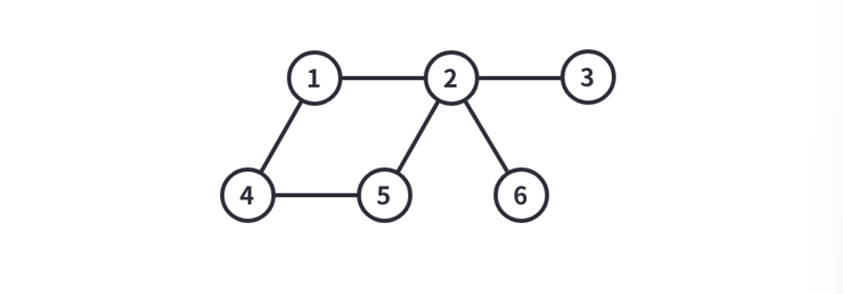
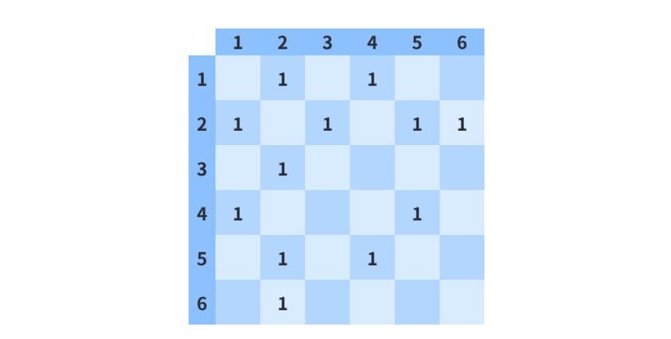

# 작은 노드

## 필요한 개념

- 그래프

## 분석

- 명시적인 형태의 그래프가 처음으로 등장하는 문제입니다. 그래프의 개념에 대해 이해하고 있고, 이를 어떻게 코드로 표현할 수 있을지 알고 있으면 어렵지 않게 풀 수 있습니다.

## 그래프

- 그래프는 어떤 정보 간의 연결 관계를 나타내는데 특화된 자료구조입니다. 아래 그림은 기본적인 형태의 그래프입니다.



- 그래프의 개념 자체는 단순합니다. **정점**이 있고, 정점 사이를 잇는 **간선**이 있습니다. 그래프를 구성하는 필수적인 요소는 이 두 가지가 끝이며, 보통은 정점과 간선에 각종 조건들이 추가가 되어서 다양한 상황을 추상화하곤 합니다. 예시로는 특정 간선이 양방향이 아닌, 단방향인 경우가 있습니다. 컴퓨터 네트워크나 도로망을 생각해보면 그래프가 어떤 느낌의 상황을 나타낼 수 있는지 감을 잡을 수 있을거에요.

## 그래프의 표현

- 이제 그래프를 어떻게 코드로 옮겨서 표현할 수 있는지를 알아보도록 합시다. 핵심은 **어떤 정점과 어떤 정점이 간선으로 연결되어 있는지**를 잘 나타내는 것입니다. 구현하는 방식은 크게 두가지가 있습니다.

## 인접행렬 (Adjacency Matrix)

- 인접 행렬은 어떤 두 정점이 연결되어 있는지를 **2차원 배열**에다가 나타내는 방식입니다. 이 방식으로 그래프를 표현하기 위해선 정점의 개수를 N이라고 했을 때 N \* N 크기의 배열이 필요합니다.
  기본적으로 배열에 있는 모든 칸의 초기값은 0입니다. 배열의 r행 c열에 있는 칸의 값이 0이라는 것은 r번 정점에서 c번 정점으로 가는 간선이 존재하지 않는다는 의미입니다  
  그런 다음 a번 정점에서 b번 정점으로 가는 간선이 존재하는 경우 a행 b열에 해당하는 칸을 1로 바꿔줍니다. 1은 0과는 반대로 간선이 존재한다는 의미입니다.  
  위에 있는 그래프를 인접행렬을 이용해 표현하면 아래 그림처럼 표현할 수 있습니다. 0인 칸은 따로 표시하지 않고, 1인 칸만 표시했습니다. 추가로 위의 그래프는 **양방향**그래프이기 때문에 a행 b열에 해당하는 칸과 b행 a열에 해당하는 칸이 모두 표시되었다는 점을 주의깊게 봐주시면 좋습니다.

  

  이렇게 그래프를 표현했을 때의 장점은 **어떤 정점과 어떤 정점이 연결되어 있는지**를 빠르게 확인할 수 있다는 점입니다. a번 정점에서 b번 정점으로 가는 간선이 존재하는지 확인하려면, 단순히 배열의 a행 b열의 값이 0인지 1인지 살펴보면 되기 때문입니다. 이 작업은 O(1) 즉 **상수시간**에 해결할 수 있습니다.

  ```java
  import java.io.*;
  import java.util.*;

  class Main {
    public static void main(String[] args) {
        Scanner scanner = new Scanner(System.in);

        // 그래프 정보 입력 받기
        int N = scanner.nextInt();  // 정점 개수
        int M = scanner.nextInt();  // 간선 개수
        int st = scanner.nextInt();

        // 인접 행렬을 표시할 배열
        int[][] graph = new int[N + 1][N = 1];
        for (int i = 0; i < M; i++) {
            int s = scanner.nextInt();
            int e = scanner.nextInt();
            graph[s][e] = 1;    // a -> b 간선이 존재한다는 의미
            graph[e][s] = 1;    // 양방향 간선 처리
        }

        // 출력
        for (int i = 1; i <= N; i++) {
            for (int j = 1; j <= N; j++) {
                System.out.println(graph[i][j] + " ");
            }
            System.out.println();
        }
    }
  }
  ```

  하지만 인접 행렬은 장점과 있는 것은 아닙니다. 우선 주어지는 정점 개수의 제곱에 비례하는 크기의 배열을 선언해야 하므로 공간 복잡도가 너무 큽니다

  - 주어지는 정점의 개수가 10^5개이면, 인접 행렬의 크기는 10^10입니다
  - `int` 자료형은 하나에 4byte 이므로, 정점의 개수가 10^5 개일 때 인접 행렬을 저장하기 위해 필요한 메모리는 4 X 10^ 10 byte = 40GB입니다. 일반적으로 문제를 풀 때 허용되는 메모리가 1GB를 넘지 않는다는 것을 생각해보면, 아무때나 사용 불가능하다는 것을 알 수 있습니다.
    그리고 어떤 정점에 여견결된 다른 정점의 정보를 알고자 할 때 다른 N개의 정점에 대해 모두 살펴봐야 한다는 점이 불편합니다.
  - 위 그래프에서 6번 정점과 어떤 정점이 연결되어 있는지 알고 싶다고 합시다.
  - 6번 정점에 실제로 연결되어 있는 정점은 2번 정점 하나 뿐이지만, 1번부터 6번까지 모든 정점에 대해 확인해보지 않고서는 어떤 정점들이 연결되어 있는지를 알 수 없습니다.
  - 즉, 인접한 정점의 정보를 알기 위해 O(N)의 시간을 투자해야 합니다. 단 하나의 연결된 정점을 찾기 위해 많은 시간을 투자하는 건 낭비처럼 보일 수 있죠
    종합해보면, 인접 행렬은 그래프의 연결 관계를 직관적으로 나태내기는 좋지만 복잡도가 높다는 점에서 범용적으로 사용하기는 어렵습니다. 그래러 보통 알고리즘 문제를 해결할 때 그래프를 표현한다고 하면 인접 행렬방식 보다는 아래에서 설명할 **인접 리스트** 방식을 주로 사용합니다.

## 인접리스트(Adjacency List)

- 인접 리스트는 어떤 정점에서 간선으로 이동할 수 있는 정점만 관리하는 표현 방식입니다.
  위의 그래프를 이번에는 인접 리스트 방식으로 표현해보겠습니다

  ```java
  import java.io.*;
  import java.util.*;

  class Main {
    public static void main(String[] args) {
        Scanner scanner = new Scanner(System.in);
        // 그래프 정보 입력 받기
        int N = scanner.nextInt();  // 정점 개수
        int M = scanner.nextInt();  // 간선 개수
        int st = scanner.nextInt();
        Map<Integer, List<Integer>> graph = new HashMap<>();

        for (int i = 0; i < M; i++) {
            int s = scanner.nextInt();
            int e = scanner.nextInt();

            // 양방향 간선 처리
            graph.get(s).add(e);
            graph.get(e).add(s);
        }
        System.out.println(graph);
    }
  }
  ```

  인접 리스트는 인접 행렬과 반대되는 특징을 가지고 있습니다. 각 정점마다 실제로 연결되어 있는 정점의 정보만을 저장하기 때문에 공간 복잡도 측면에서 효율적이며, 실제로 어떤 정점이 연결되어 있는지를 찾기 위해서 N 개의 정점을 모두 확인해보지 않아도 됩니다. 대신에 어떤 두 정점을 연결하는 간선이 존재하는지를 빠르게 확인할 수는 없습니다.
  하지만 인접 행렬과 비교했을 때, 인접 리스트가 가지는 장점이 그래프 문제를 푸는 대부분의 경우에서 훨씬 강력합니다. 이 문제는 인접 리스트 표현을 이용해 풀어보도록 하겠습니다.

## 그래프 탐색

- 그래프가 무엇인지, 그리고 그래프를 어떻게 코드로 나타낼 수 있는지 앞에서 배워 보았습니다.
  이제 그래프 문제를 어떻게 풀 수 있는지 알아봐야겠죠. 그래프는 아무래도 **연결관계**를 표현하기 때문에, 우리가 알아야할 것은 바로 그래프에서 탐색을 하는 방식입니다. **그래프 탐색**이란 간선을 따라서 그래프의 모든 정점을 방문하는 과정을 말합니다.
  다음에 방문할 정점의 순서를 어떻게 정하느냐에 따라서 다양한 그래프 탐색 방법이 있을 수 있지만, 대표적인 그래프 탐색 방법에는 DFS와 BFS가 있습니다. 두 방법 모두 매우 자주 쓰이고 중요한 탐색 기법이기 때문에 반드시 알아둬야 하는 내용입니다.

## 문제 풀이

- 사실 이번 문제에서는 DFS와 BFS와 같은 탐색 방식을 쓰지는 않고, 문제에서 주어진 대로 우직하게 구현하면 됩니다
  인접 리스트로 구현을 했다면, 어떤 정점에 인접한 정점 목록을 아래 코드처럼 탐색할 수 있습니다

  ```java
  graph = {
    1: []   // 예를 들어, 여기에는 1번 정점과 인접한 정점들의 배열이 들어갑니다.
  }

  currentNode = 1;
  // cur과 인접한 정점은 graph.get(cur)에 들어 있을테니, graph.get(cur)의 값들을 순회하면 됩니다
  for (int next : graph.get(currentNode)) {
    // Do Something
    // 여기에 원하는 동작을 추가하면 됩니다
  }
  ```

  풀이의 흐름도 문제 지문에 제시된 내용에서 크게 벗어나지 않습니다.

  1. 그래프를 입력 받습니다.
  2. 현재 정점에서 인접한 정점 중, 아직 방문하지 않았으면서 가장 번호가 작은 정점을 찾습니다
  3. 2에서 찾은 정점으로 이동합니다
  4. 더이상 이동할 수 없을때까지 2,3번 과정을 반복합니다
  5. 방문한 정점의 개수와 마지막에 위치한 정점을 출력합니다
     입력과 출력은 어려운 부분이 아니고, 중요한건 2~4번 과정의 구현입니다. 더이상 이동할 수 없을때까지 반복해야 하니 아래코드처럼 while 문을 이용해서 구현할 수 있습니다.

  ```java
  graph = {
    // 예시: 정점들과 각 정점에 인접한 정점들의 리스트
    // 1: [2, 3, 4],
    // 2: [1, 5],
    // ...
  };

  int K;    // 시작 정점
  int[] visited = new int[N + 1];
  Queue<Integer> q = new LinkedList<>();
  q.add(K);
  int answer = 0;   // 방문한 노드 개수
  int currentNode = K;  // 마지막으로 방문한 노드 번호

  // 탐색할 수 있는 노드가 있을 때까지 탐색
  while (!q.isEmpty()) {
    currentNode = q.poll();
    // 방문체크
    visited[currentNode] = 1;
    answer++;   // 정점을 방문할 때마다 답을 1씩 증가시킨다

    // 가장 작은 정점의 번호를 다음 방문 정점으로 선택하기 위해서 후보를 정렬합니다
    List<Integer> tempNodes = graph.get(currentNode);
    if (tempNodes != null && !tempNodes.isEmpty()) {
        Collections.sort(tempNodes);
        for (int nextNode : tempNodes) {
            // 방문할 수 있는 정점이 나오면, 반복문을 탈출합니다
            if (visited[nextNode] == 0) {
                q.add(nextNode);
                break;
            }
        }
    }
  }
  ```

## 답안지

```java
import java.io.*;
import java.util.*;

class Main {
    public static void main(String[] args) {
        Scanner scanner = new Scanner(System.in);
        // 그래프 정보 입력 받기
        int N = scanner.nextInt();  // 정점 개수
        int M = scanner.nextInt();  // 간선 개수
        int K = scanner.nextInt();
        Map<Integer, List<Integer>> graph = new HashMap<>();

        for (int i = 0; i < M; i++) {
            int s = scanner.nextInt();
            int e = scanner.nextInt();
            // 노드의 존재 여부 확인
            if (!graph.containsKey(s)) {
                graph.put(s, new ArrayList<>());
            };
            if (!graph.containsKey(e)) {
                graph.put(e, new ArrayList<>());
            }
            graph.get(s).add(e);
            graph.get(e).add(s);
        }

        int[] visited = new int[N + 1];
        Queue<Integer> q = new LinkedList<>();
        q.add(K);
        int answer = 0;     // 방문한 노드의 개수
        int currentNode = K;    // 마지막으로 방문한 노드번호
        while (!q.isEmpty()) {
            currentNode = q.poll();
            visited[currentNode] = 1;
            answer++;
            List<Integer> tempNodes = graph.get(currentNode);
            if (tempNodes != null && !tempNodes.isEmpty()) {
                Collections.sort(tempNodes);
                for (int nextNode : tempNodes) {
                    if (visited[nextNode] == 0) {
                        q.add(nextNode);
                        break;
                    }
                }
            }
        }
        System.out.println(answer + " " + currentNode);
    }
}
```
