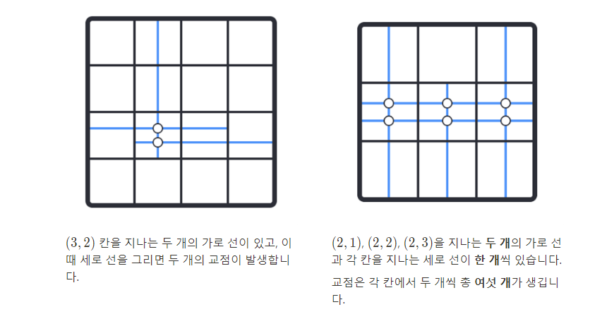

# 중첩점

## 필요한 개념

- 동적 프로그래밍

## 분석

- 한 변의 길이가 N인 정사각형을 격자 모양으로 바꾼 뒤, M개의 직선을 규칙에 따라서 그립니다. 이때 직선들 끼리 교차하는 교점의 수를 세는 문제입니다. 문제의 내용은 간단하지만, 풀기 위한 개념은 간단하지 않습니다

## 문제풀이

- 문제풀이를 위해서 떠오른 방법은 완전 탐색입니다. (y, x)에서 시작하는 직선을 그리려고 할때 지금까지 (y, x)에서 그려진 직선을 모두 알아야합니다. (y, x)에서 상/하로 그려질 직선은 좌/우로 그려진 직선의 개수만큼 점이 생기고, 반대로 좌/우로 그려질 직선은 상/하로 그려진 직선의 개수만큼 점이 발생합니다  
  그렇다면 주어지는 직선의 개수가 `100,000`이기 때문에 최악의 경우는 O(M^2)만큼의 시간이 걸립니다. `100억`번의 계산을 하는 문제가 주어지지는 않습니다
  때문에 이 문제는 탐색 문제가 아니라 동적 프로그래밍 문제입니다. 이전 계산을 기록하면서 현재의 계산을 간소화하는 방법이 필요한 동적 프로그래밍 문제입니다

## 규칙이해하기

- 문제의 이미지를 보면서 선이 발생했을 때 성질을 이해하면 문제의 요구사항은 간결해집니다



- 이 성질을 이용해서 문제를 해결하려고 합니다
  - (y, x) 칸에서 위/아래 방향으로 그리는 선이 생기면, 해당 칸부터 끝까지 있는 모든 칸의 가로 선의 개수가 발생하는 교점의 개수이다
  - (y, x) 칸에서 좌/우 방향으로 그리는 선이 생기면, 해당 칸부터 끝까지 있는 모든 칸의 세로 선의 개수가 발생하는 교점의 개수이다
    이렇게 문제의 해결의 첫번째 개념을 만들 수 있습니다

## 기록하기

- 중첩 점 문제는 규칙을 이해했다면, 결과적으로 어떤 선을 그었을 때, 선이 이동하는 경로에 선의 개수만 알고 있어도 생기는 점의 개수를 구할 수 있습니다.
  다만 가로 선이라면 세로 선의 개수가 필요하고, 세로 선이면 가로 선의 개수를 알아야 함으로, 이를 구별해서 선의 개수를 관리해야 합니다. 다양한 방법이 있지만, 이번 해설에서는 3차원 매트릭스로 구현하려고 합니다
  가장 먼저 행렬 2개 구현합니다. 각각 행렬은 가로 선, 세로 선만 관리하는 행렬입니다

  ```java
  // verMatrix: 어떤 좌표에서 세로 선의 개수만 관리
  int[][] verMatrix = new int[N+1][N+1];
  // horMatrix: 어떤 좌표에서 가로 선의 개수만 관리
  int[][] horMatrix = new int[N+1][N+1];
  ```

  `verMatrix`와 `horMatrix`를 모두 관리할 수 있는 `DP`변수를 만든다고 생각하면 됩니다

  ```java
  int[][][] dp = new int[2][][];
  // dp[0] = verMatrix, dp[1] = horMatrix
  ```

  꼭 배열로 만들 필요는 없고, 본인이 구조를 작성하고 싶은 방법에 따라서 기록을 저장할 구조를 작성하시면 됩니다
  간단한 예시로 들어가는 일반적인 행렬을 작성한 뒤, 각각 요소에 넣을 데이터가 `[선의 개수, 방향]`으로 하셔도 됩니다. 혹은 객체를 활용해서 선언해도 큰 문제는 없습니다. 즉 어떤 구조라도 **선의 개수와 방향**을 함께 가지고 있다면 큰 문제는 없습니다

  ```java
  int[][] dp = new int[N+1][N+1];
  dp[1][1] = new int[] {3, 'V'};
  // vertical 상태가 3개 있음
  ```

## 기록하기2

- 이제부터 진행되는 선긋기를 중첩 기록할 수 있는 `dp`라는 자료형을 선언했으니 기록만 하면 됩니다
  그 전에 `dp[0]`에 할당된 세로 선만 기록할 것이고, `dp[1]`에 가로 선만 기록하면 됩니다
  만약에 `2 1 R` 을 수행하면 (2, 1) 칸에서 오른쪽 끝으로 이동합니다. 수평 이동을 하기 때문에 `y`좌표는 동일하게 `x`좌표는 `2 -> N`까지 선을 그을 수 있습니다.
  이를 코드로 표현하면 아래와 같이 표현할 수 있어요

  ```java
  // xPos = command의 x 좌표
  // yPos = command의 y 좌표
  // dp[1]에 들어가는 가로 표시만 기록하는 매트릭스의 새로운 선을 그린다
  // dp[1][yPos][i] 값을 1 추가한다
  for (int i = xPos; i <= N; i++) {
    dp[1][yPos][i] += 1;
  }
  ```

  이 문제는 선을 그리는 것도 중요하지만, 발생하는 중첩 점의 개수를 세는 것도 중요합니다. `R`이라는 명령어는 가로로 그리는 선이기 때문에 세로 선의 개수가 중첩 점을 만듭니다. 세로 선은 `dp[0]`에 있다는 사실을 알고 있다면, 선이 지나는 칸에 그려진 세로 선의 개수를 알 수 있습니다

  ```java
  / *
  dp[0]에 들어있는 세로 선 기록하는 매트릭스의 값을 꺼내온다
  spot_count 값을 매트릭스 값만큼 추가한다
  */
  for (int i = xPos; i <= N; i++) {
    spot_count += dp[0][yPos][i];
    dp[1][yPos][i] += 1;
  }
  ```

  자 `R` 명령어를 완성하면서 우리는 나머지 명령어에 대해서 그림을 그려볼 수 있습니다

  - `U`나 `D` 명령어의 경우에는 `x` 좌표는 고정이면서, `y`좌표가 `N`으로 가거나 `1`로 갑니다.
  - `R`이나 `I` 명령어의 경우에는 `y` 좌표는 고정이면서, `x` 좌표가 `N`으로 가거나 `1`로 갑니다
    이 성질을 이용해서 4개 명령에 대해서 코드를 작성하면 아래와 같습니다

  ```java
  for (int s = 0; s < M; s++) {
    int x = scanner.nextInt();
    int y = scanner.nextInt();
    String dir = scanner.next();
    scanner.nextLine(); // Consume the newline
    /*
    D나 U의 경우
    spot_count는 가로 선을 관리하는 DP[1]에서 추출
    DP 갱신은 세로 선을 관리하는 DP[0]을 갱신
    */
    if (dir.equals("D")) {
        for (int i = x; i <=N; i++) {
            spotCount += dp[1][i][y];
            dp[0][i][y] += 1;
        }
    }

    else if (dir.equals("U")) {
        for (int i = 1; i <= x; i++) {
            spotCount += dp[1][i][y];
            dp[0][i][y] += 1;
        }
    }

    /*
    R나 L의 경우,
    spot_count는 세로 선을 관리하는 DP[0]에서 추출
    DP 갱신은 가로 선을 관리하는 DP[1]을 갱신
    */

    else if (dir.equals("R")) {
        for (int i = y; i <= N; i++) {
            spotCount += dp[0][x][i];
            dp[1][x][i] += 1;
        }
    }
    else if (dir.equals("L")) {
        for (int i = 1; i<=y; i++) {
            spotCount += dp[0][x][i];
            dp[1][x][i] += 1;
        }
    }
  }
  ```

  이 계산이 끝난 뒤에, `spot_count`를 출력하면 끝입니다. 자세한 변수 선언은 정해 코드를 참고해주세요.

## 정해코드

```java
import java.util.Scanner;

public class Main {
    public static void main(String[] args) {
        Scanner scanner = new Scanner(System.in);

        int N = scanner.nextInt();
        int M = scanner.nextInt();
        scanner.nextLine(); // consume the newline

        int[][][] dp = new int[2][N+1][N+1];
        int spotCount = 0;

        for (int s = 0; s < M; s++) {
            int x = scanner.nextInt();
            int y = scanner.nextInt();
            String dir = scanner.next();
            scanner.nextLine(); // consume the newline

            if (dir.equals("D")) {
                for (int i = x; i <= N; i++) {
                    spotCount += dp[1][i][y];
                    dp[0][i][y] += 1;
                }
            } else if (dir.equals("U")) {
                for (int i = 1; i <= x; i++) {
                    spotCount += dp[1][i][y];
                    dp[0][i][y] += 1;
                }
            } else if (dir.equals("R")) {
                for (int i = y; i <= N; i++) {
                    spotCount += dp[0][x][i];
                    dp[1][x][i] += 1;
                }
            } else if (dir.equals("L")) {
                for (int i = 1; i <= y; i++) {
                    spotCount += dp[0][x][i];
                    dp[1][x][i] += 1;
                }
            }
        }

        System.out.println(spotCount);
    }
}
```
