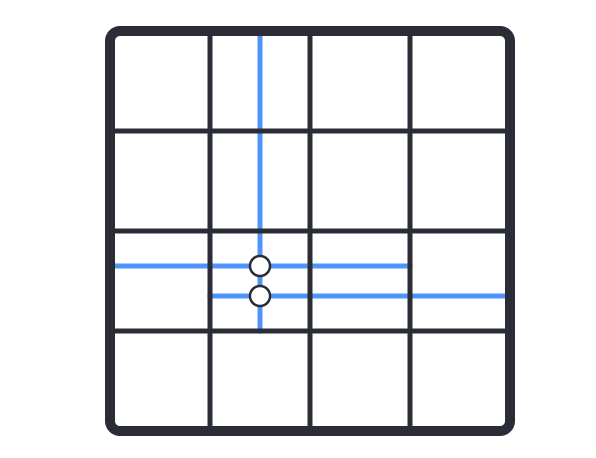
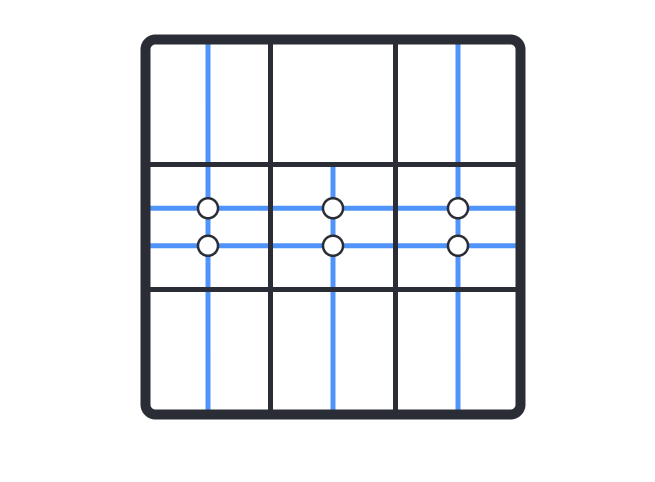

# 중첩 점

## 문제

- 한 변의 길이가 N인 정사각형이 있다. 플레이어는 이 정사각형 위에 M 개의 반 직선을 그린 뒤, 두 반직선이 교차하는 점의 수를 세려고 한다. 플레이어가 반직선을 그리는 과정은 아래와 같다
  1. 반직선을 그리기 시작할 칸 (y, x)를 정한다. (y, x)는 주어진 정사각형을 1X1 크기의 정사각형으로 나눴을 때, y번째 행의 x번째 열에 해당하는 칸이다
  2. 반직선을 그릴 방향 d를 정한다. 방향은 상하좌우 중 하나이며, 항상 정사각형 테두리의 가로 혹은 세로와 평행하다
  3. 반직선을 그린다. 반직선은 항상 시작 칸의 테두리에서부터 시작하며, 같은 칸을 지나는 평행한 직선이 서로 만나지 않도록 그린다
     아래 그림은 길이가 4인 정사각형 위에 다음 세 개의 직선을 그린 그림이다.
  - (3,2), 오른쪽/, (3, 3), 왼쪽/(3, 2), 위쪽
    
    (3, 2)칸과 (3,3)칸을 지나는 두 개의 가로 반 직선이 있지만, 두 반직선은 서로 평행하기 때문에 중첩점이 생기지 않는다. 그러나 (3, 2)칸을 지나는 세로 반직선과 두 반직선은 교차하므로 결과적으로 두 개의 중첩점이 생긴다
    플레이어가 모든 반직선을 그린 뒤 생기는 중첩 점의 개수를 구해보자

## 예제설명

- 첫번째 예제를 그림으로 나타내면 아래와 같이 여섯 개의 중첩점이 생긴다

## 입력

- 첫째 줄에 정사각형 크기 N과 그리려는 반직선의 개수 M이 공백을 두고 주어진다  
  다음 M개의 줄에는 플레이어가 그을 반직선의 정보를 나타내는 yi, xi, di가 공백을 두고 주어진다. (yi, xi)칸에서 시작해 di방향으로 반직선을 긋는다는 의미이다.
  - 1<=N<=100
  - 1<=M<=100_000
  - 1<=xi,yi<=N
  - di는 U, D, L, R의 네 문자중 하나이다. 각각 상하좌우 방향을 의미한다

## 출력

- 모든 반직선을 그렸을 때, 중첩 점의 개수를 출력하시오
