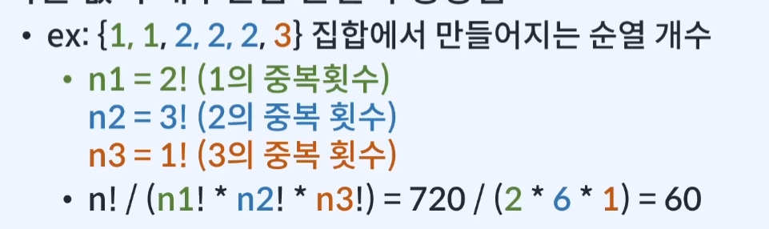

# 재귀함수이론

## 재귀함수란

- 자기 자신을 호출하는 함수

- e.g.

  ```class Main {
        public void myFunction(int n) {
            // do something
            myFunction(n - 1);
            // do something
        }
     }
  ```

- 왜 사용할까?
  - 1. 하나의 **커다란 문제**를 **작은 문제**로 나누어 해결
  - 2. 문제를 **귀납적**으로 생각하기 위해서
       {i}번째 답을 구하기 위해 (i-1), (i-2)번째 결과 활용

## 재귀함수 예시 - 숫자출력

### 숫자를 출력하는 함수를 작성

1. 함수: 1부터 N까지 오름차순으로 출력
2. 함수: N부터 1까지 내림차순으로 출력

- 단, 반복문을 사용하지 않고 재귀함수를 이용해 작성

## 재귀함수 잘 설계하는 방법

- 재귀함수를 작성할 때 재귀함수의 영역 안에 Base Case와 Recursive Case와 두 개의 영역으로 나누어 생각하는 것이 중요하다
- Base Case
  - 계산 없이 바로 답을 구할 수 있는 경우
  - 재귀호출을 멈추고 함수가 종료되는 조건 -> 무한루프에 빠지지 않도록 한다
  - **적어도 하나 이상의 Base Case**가 있어야한다.
- Recursive Case
  - 재귀 호출이 일어나는 경우
  - **문제를 작은 부분으로 쪼개기 위함**
  - 함수가 호출될수록 **부분 문제가 Base Case에 수렴**해야한다

## 재귀함수 설계시 중요한 점

- 귀납적으로 생각하기
  - 큰 문제를 작은 부분문제로 분할
  - 부분 문제들은 재귀를 통해 하위문제를 해결
- 중복계산방지
  - 동일한 계산이 반복될 가능성이 있다면 메모리에 저장

## 예제문제 - BOJ2747: 피보나치 수

## 수학적 의미의 함수

- 함수 내에 상태값을 보유하지 않는 함수를 수학적 의미의 함수라 한다
  - 호출횟수 또는 타이밍에 따라 값이 변하지 않는다
  - 한번 계산한 값을 저장해두면 재활용할 수 있다

## 순열(permutation)

- 정의: 집합 안에서 가능한 모든 집합을 나열하는 것
- 특징
  - 중복이 없는 n개의 원소의 집합에서는 n!개의 순열이 생성됨
  - 중복된 원소가 있는 경우에는 각 원소의 {중복횟수!}의 곱으로 나눈 값의 개수만큼 순열이 생성됨
    
